# Introduction to Dark Web Operations Capstone Writeup

This writeup is for Introduction to Dark Web Operations Capstone which is a part of Security Blue Team's Introduction to Dark Web Operations course.

Link to the course - [Introduction to Dark Web Operations](https://www.securityblue.team/courses/introduction-to-dark-web-operations)

## Challenge

```
Hi Investigator, we need you...

Last month we were informed about a huge drug trafficking network that was taking place in the UK through the TOR network, in response to this situation we set to work and managed to dismantle their main TOR marketplace to stop drugs reaching the streets of the UK. However, we were informed that one of the creators of this network managed to evade us and is now continuing to carry out this type of activity. This is where you come in. We think we have found the site that this individual uses to "tell their stories" regarding criminal activity.

We need you to find evidence that will allow us to identify this subject, relate it to the drug trafficking crimes, and bring them to justice. We know this is a difficult task, but we are confident in your abilities and we are sure that you will succeed.

1] Gain access to the site (We're sure there's some way for users to gain valid credentials fairly easily).
2] Find evidence that the individual is involved in drug trafficking.
3] Find any information about the next shipment that is coming in, so we can seize it.


-------------++---------------++---------------++---------------++--------------

                    _********************_
=================== \  CHALLENGE REPORT  / ====================
                      ******************
  _________________________________________________   
 |   ___                                           | 
 |  |    \          __      ___  _____  _____      | 
 |  | |\  \        / /     ´ _ `´  __ `´  ___`     | 
 |  | | \  \  /\  / /     | | | | !_/ /! ´--.      | 
 |  | | /  /\/  \/ / ___  | | | |  __/  `--. ¡     |
 |  | !/  /\  /\  / ´   ` ! !_! ! |    /`--´ !     |
 |  !____/  \/  \/  `---´  `___´!_!    `----´      |
 |                                           (SBT).|
  ------------------------------------------------- 


 Known Info:
===================				      
[*] DWebsite:  5xdv6dqxv2bsbmlgttsq3ma3nw6ffa2zhqbl7o4w46p32wsqulzrtsqd.onion


 Requested Info:
==============================
1) What command is used in the Console to generate valid credentials?
2) What is the suspect's site username?
3) What is the suspect's first and last name?
4) What country is the suspect currently living in?
5) What is the date of the first post related to drug trafficking?
6) What is the date of the latest post related to drug trafficking?
7) What type of encoding has been used on the site content?
8) When is the next drug shipment coming into the UK?
9) What are the GPS coordinates of the shipment delivery location?  
10) What is the name of the seaport where the shipment is being delivered?
```

## Tools Required

It is clear from the challenge that we will navigate to the .onion site. Hence, in order to navigate to .onion site, we will require Tor Browser. For added safety, I also suggest using a VPN before connecting to the Tor network.

For this capstone, I have used Tor Browser and ProtonVPN. You may choose the VPN of your choice.

Download Tor Browser from [here](https://www.torproject.org/download/)

Download ProtonVPN from [here](https://protonvpn.com/)

## Solution

### Visit the .onion site

First, connect to the VPN. Then open the Tor Browser and connect to the Tor network.

Copy and paste the provided .onion link in the Tor Browser. Hit Enter. This will open up a webpage as shown in the image below.

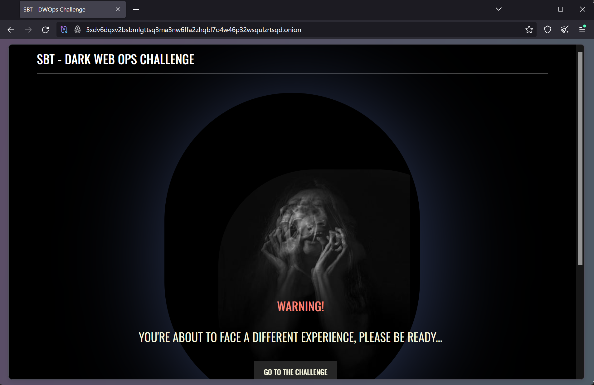

On this webpage, click on the "GO TO THE CHALLENGE" button. This will lead to a login page as shown in the image below.

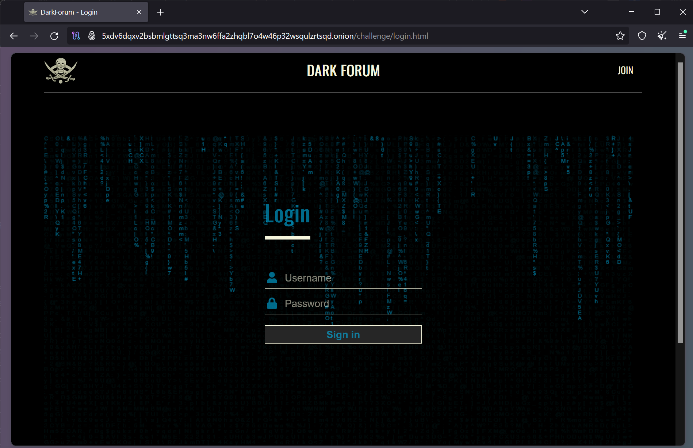

### Finding Login Credentials

Based on the questions in the requested info, it is clear that we need to find a function for the console, that will generate login credentials for this website.

Right-click anywhere on the page and click Inspect. This will open a console. You will see various tabs that you can navigate to. Click on the Debugger tab. In this tab, we can search for any keyword across all the loaded scripts.

If I were to write a function to generate user credentials, I would name it something like generateUserCredentials() or createUserCredentials(). Hence, I searched for the keyword "credential" and I found the required function name, as shown in the image below.

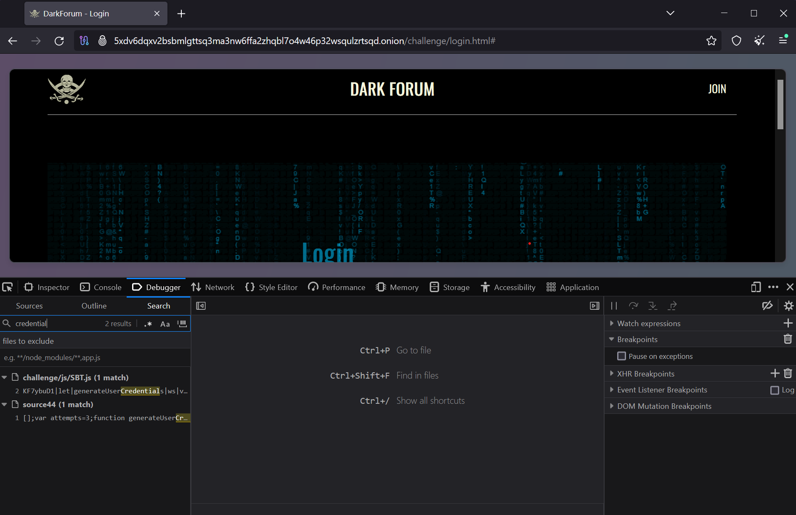

The name of the function is `generateUserCredentials()`. This answers our first question.

Now go back to the console, type in the function, and hit enter. This will give you a string. The function's output will be as shown in the figure below.

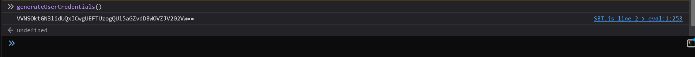

This is a Base64-encoded string. Hence, we need to decode it into plain text. To do so, we will use an online Base64 decode tool. You may use a tool of your choice. I used the tool at [https://www.base64decode.org/](https://www.base64decode.org/). Once you decode the string, you can see the user credentials: username and password, as shown in the image below.

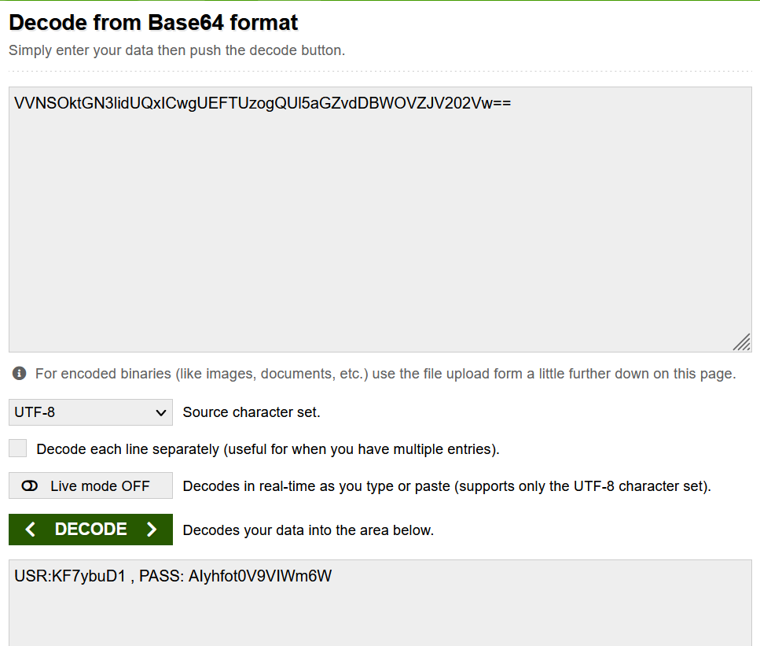

Now that we have user credentials, enter those credentials at the login page and log in to the website.

### Exploring the Website

Once we enter the credentials and log in to the website, we are greeted with a home page. However, the home page is full of numbers and no sentences. The website content is encoded. The following image shows the website's homepage.

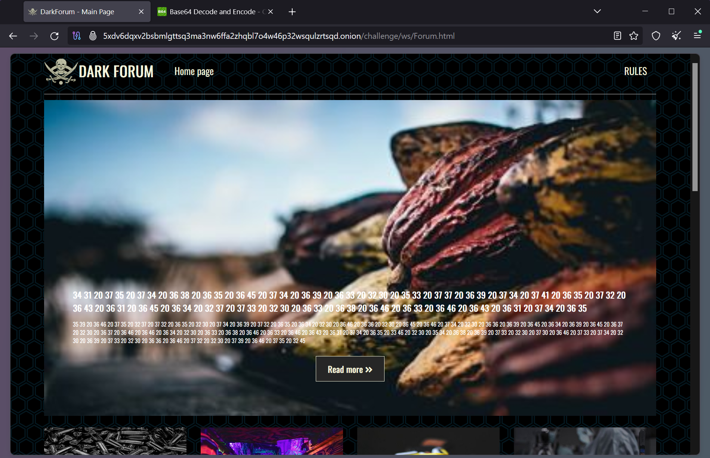

This looks like a Hex ASCII encoding. I know this since I have seen this type of encoding before. Hence, we need to decode this to get the plaintext. You may choose a tool of your own. I used the tool at [https://www.rapidtables.com/convert/number/hex-to-ascii.html](https://www.rapidtables.com/convert/number/hex-to-ascii.html)

So, I pasted the content shown on the main page into this conversion tool and got another Hex output, as shown in the image below.

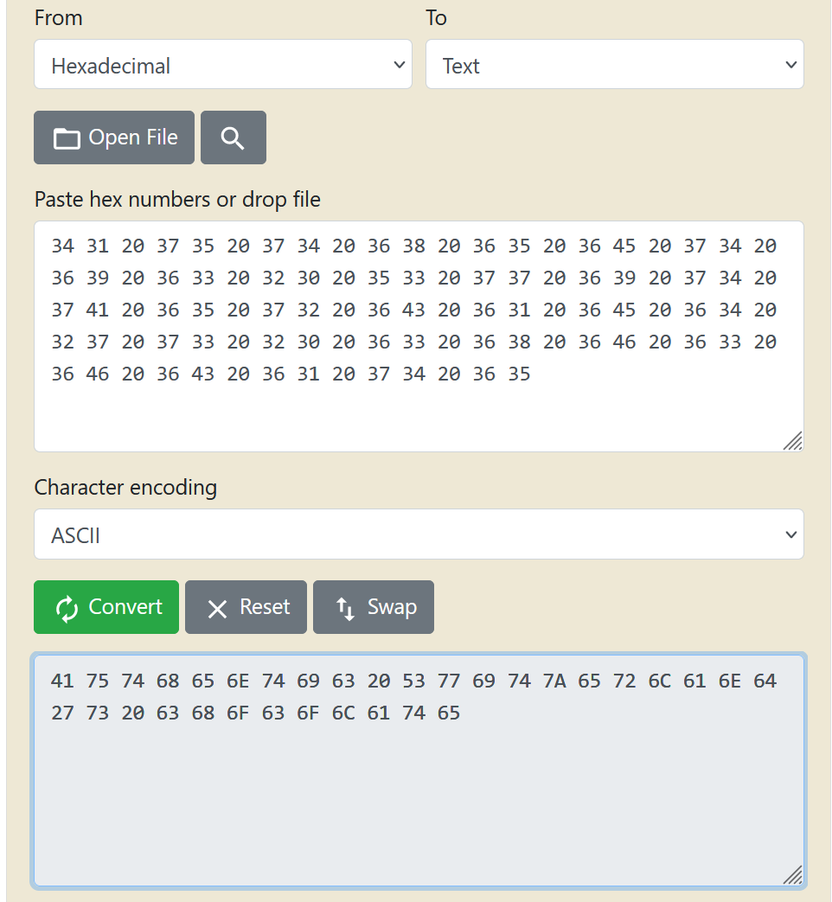

This is interesting. It again looks like Hex ASCII. The first number 41 (or 0x41) is hex for 65 which is the ASCII for the letter "A". So let's paste the output again into the convertor tool and convert this hex to ASCII. This time, we got plaintext as shown in the image below.

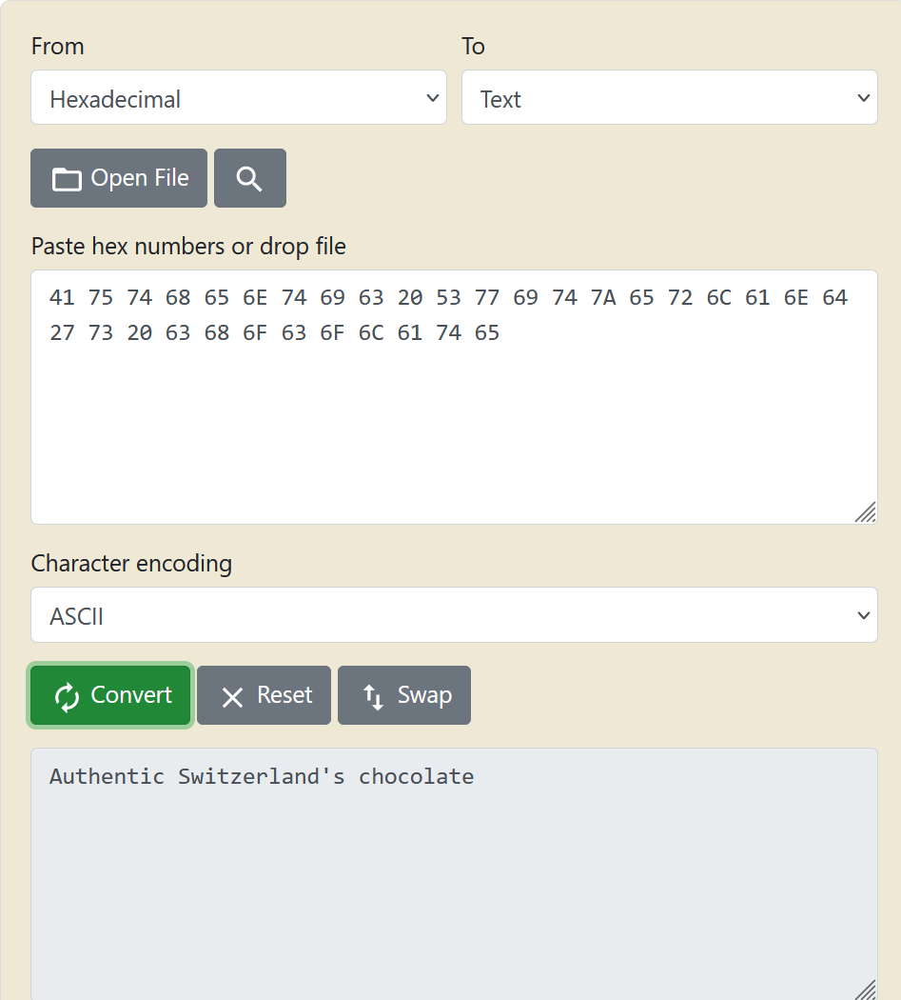

I repeated this step for all the posts and found an interesting post that may resemble dealing with drug trafficking as requested in the challenge. The following image shows the post being considered. 

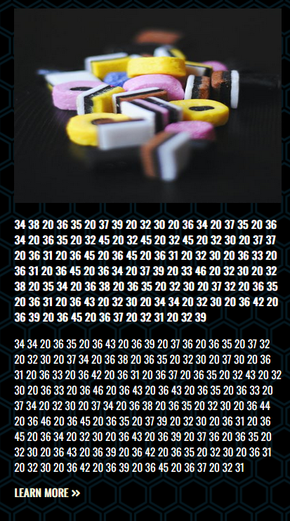

The plaintext obtained after converting the encoded text is shown in the image below. The author mentions delivering candies (it must be a code name for drugs) and collecting payment.

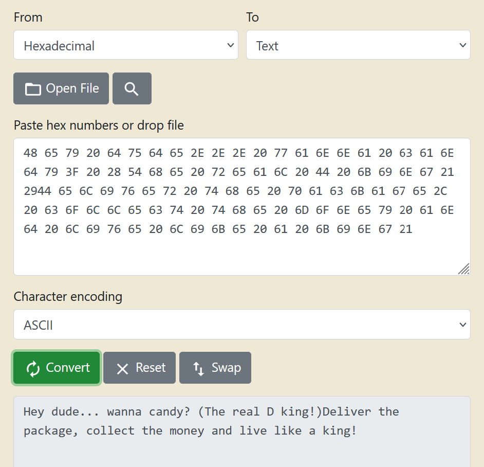

### Suspect's Posts

Hence, we click on this post and are redirected to a thread where the author has posted several posts. The username of the author, who is now a suspect, is `DarkChest984` as mentioned at the bottom of the page (see screenshot below).

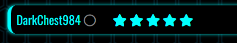

The first post where the suspect talks about the drug dealing business was posted on `26/11/20XX` as seen in the image below.

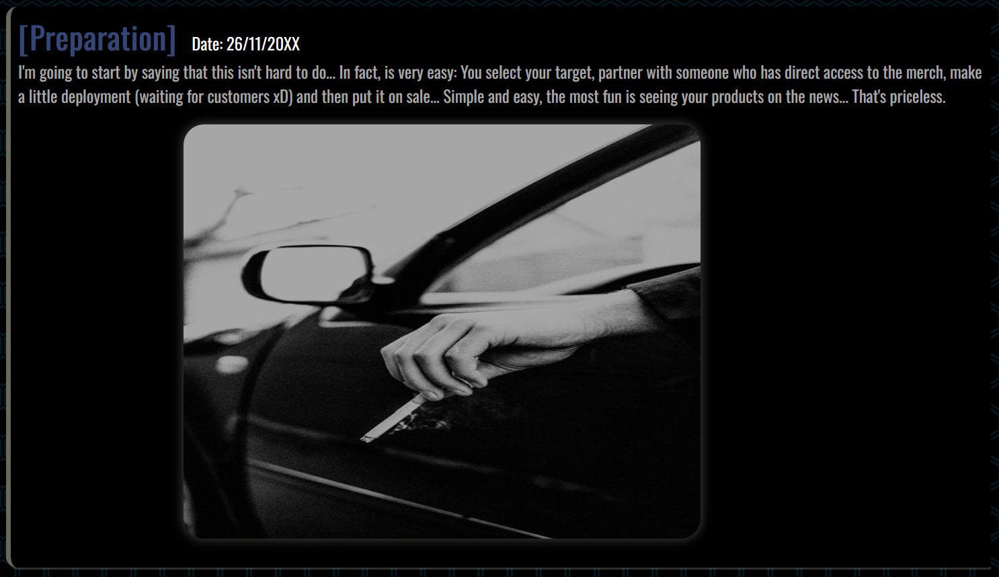

As we scroll down the page, we see multiple posts related to the drug trafficking business where the suspect is sharing their experience and also talks about an upcoming business opportunity.

There is an interesting post where the suspect has shared an image containing their passport and flight ticket, as shown in the image below.

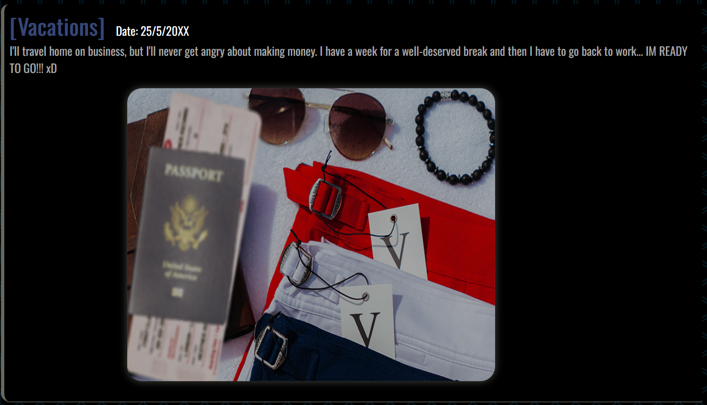

This image contains some important details. The following image is the zoomed-in image of the post focusing on the passport and the flight ticket.


We get many details about the suspect from this image alone.

* The suspect's country of citizenship is `United States of America` (mentioned on the passport)
* The name of the suspect is `Kestner Richard` (mentioned in the upper right and lower left corners of the ticket)
* The flight is from `London to New York`. This implies that the suspect is residing in `London, UK`.

Another interesting post is where the suspect mentions a seaport. The post contains an image of the seaport and information that indicates this seaport was the location where the drug dealing business was and will be carried out. The post is shown in the image below.

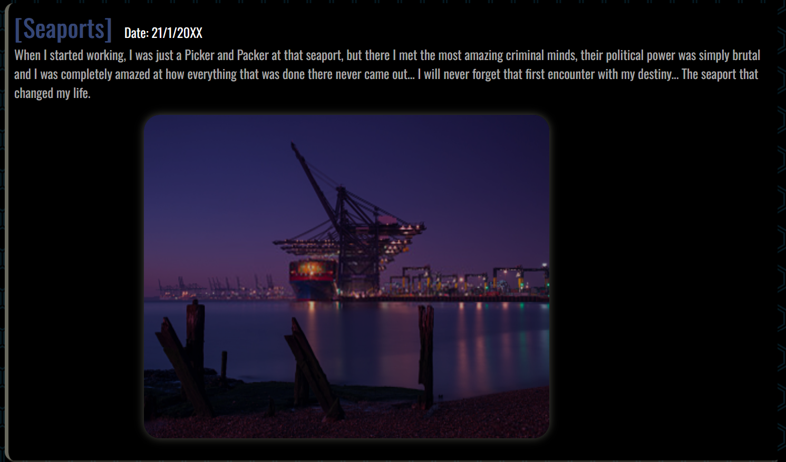

The most recent post of the suspect has a computer screen with a sticky note on it that contains some written details. It was posted on `26/10/20XX`. This post is shown in the image below.

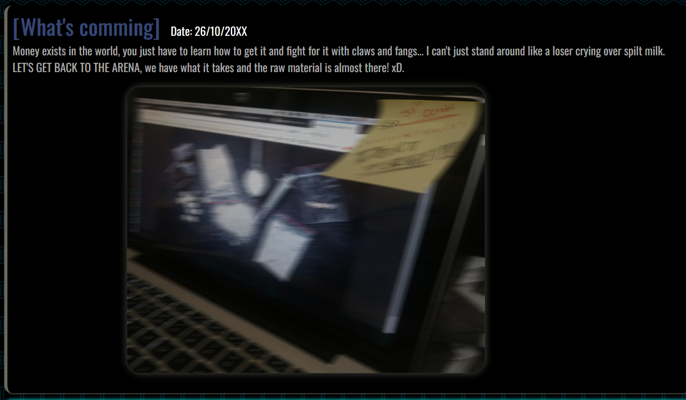

We need to zoom in on the sticky image as it contains some important details we require. The following image shows a zoomed-in image of the sticky note.

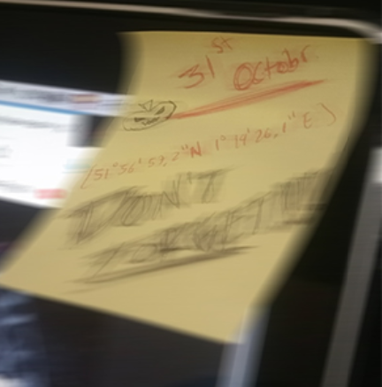

The sticky note contains two important details:

* A date: `31st October`. This implies that the next shipment date for the drugs is 31st October.
* Coordinates: `51°56’57.2”N 1°19’26.1”E`. These are the coordinates where the shipment will arrive, and the deal will take place.

I put the coordinates on Google Maps and the location is `Felixstowe Port, UK`. Upon further investigation, we can find out that the image of a seaport mentioned in a previous post is that of Felixstowe Port.

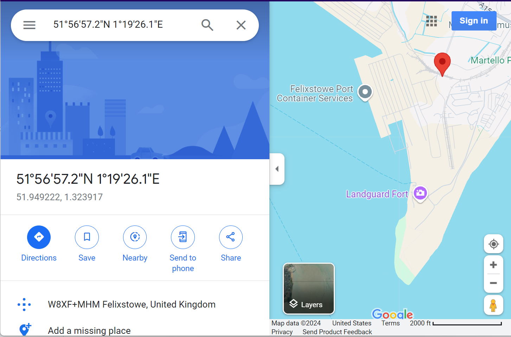

Now, we have all the necessary details to complete the challenge.

### Answering the Challenge

Based on the collected information, we can now answer all the questions asked in the challenge.

1. What command is used in the Console to generate valid credentials? `createUserCredentials()`
2. What is the suspect's site username? `DarkChest984`
3. What is the suspect's first and last name? `Kestner Richard`
4. What country is the suspect currently living in? `United Kingdom (UK)`
5. What is the date of the first post related to drug trafficking? `26/11/20XX`
6. What is the date of the latest post related to drug trafficking? `26/10/20XX`
7. What type of encoding has been used on the site content? `Hexadecimal ASCII`
8. When is the next drug shipment coming into the UK? `31st October (31/10/20XX)`
9. What are the GPS coordinates of the shipment delivery location? `51°56’57.2”N 1°19’26.1”E`
10. What is the name of the seaport where the shipment is being delivered? `Felixstowe Port`

This marks the end of the challenge.
