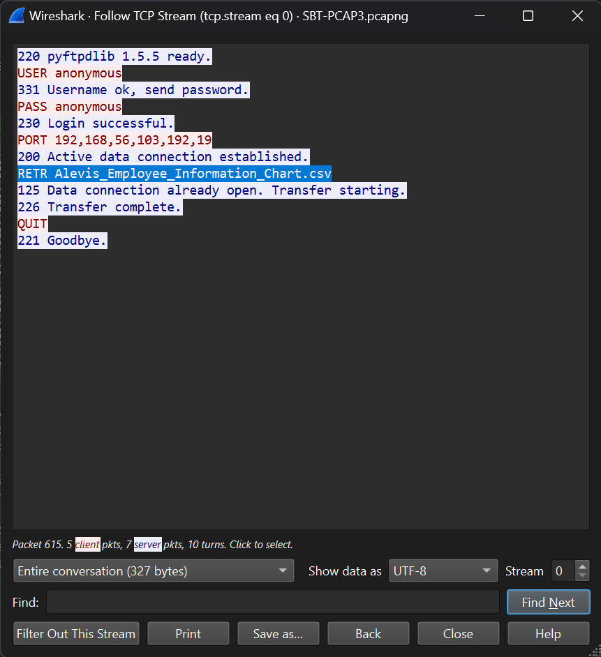

# Introduction to Network Analysis Capstone Writeup

This write-up is for the Network Analysis Capstone which is part of the Security Blue Team's Introduction to Network Analysis training course.

Link to the course: [Introduction to Network Analysis](https://www.securityblue.team/courses/introduction-to-network-analysis)

## Challenge

The following is the challenge scenario and requested information:

```

Alexis is a fictional cybersecurity company with thousands of employees. An attacker has gained unauthorized entry into its premises and has connected their laptop to an unused port on a switch. The attacker now has access to the company's internal networks. Within the internal network, there is a central server where critical proprietary data is stored. In this capture, the attacker is attempting to collect SSH credentials that they can use to log into the central server.

Given File: SBT-PCAP3.pcap

Challenge Questions:

1. What is the MAC address of the attacker?
2. What is the type of attack which is taking place that allows the attacker to listen in on conversations between the central server and another host?
3. What is the file which was downloaded from the central server?
4. What department does Borden Danilevich work in?
5. What is the SSH password of the Domain Administrator?

```

## Tools Required

I have analyzed the _SBT-PCAP3.pcap_ file using Wireshark. You may download Wireshark from [here](https://www.wireshark.org/download.html)

## Solution

Let's analyze the _SBT-PCAP3.pcap_ file in order to answer the challenge questions.

### Finding Attacker's MAC Address

As per the scenario, the attacker gained unauthorized access to an unused switch port and has connected their laptop to that port.

Hence, since the laptop is a new device connected to the network, the first thing it will do is send out ARP Requests to learn MAC address of the machines present in the network. As we open the _SBT-PCAP3.pcap_ file, we see a bunch of ARP requests as shown in the following images.


It is clear from these ARP requests that the IP address of the newly added machine is `192.168.56.111` and its MAC address is `08:00:27:3d:27:5d`. This is the attacker's machine.

### Attack Type

The type of attack that allows an attacker to listen on the conversation between two machines, or in our case between the central server and another host, is `man in the middle` attack.

### Analyzing the PCAP Statistics

Before moving on to the next question, let us first analyze the statistics of the _SBT-PCAP3.pcap_ file in order to get more insight on the type of traffic and conversations between endpoints.

#### Protocol Heirarchy

Let us first look at the Protocol Heirarchy of the capture. In the menu bar of Wireshark, select _`Statistics > Protocol Heirarchy`_. This will open up a new window as shown in the image below.


Under the TCP section, we can notice that there is SSH and FTP traffic.

We have already been told that the attacker is attempting to collect SSH credentials. Based on the significant amount of SSH traffic it looks like the attacker may have succeeded.

Also, the presence of FTP traffic is also important for our analysis. The FTP traffic might provide information on the file that we are looking for. This file may contain information on SSH login credentials, which attacker intercepted through man in the middle attack, and then gained access to the SSH server.

#### Conversations

Let us look at the Conversations to figure out which machines are communicating with each other. In the menu bar of Wireshark, selece _`Statistics > Conversations`_. This will open up a new window as shown in the image below.


Select the TCP tab in the Conversations window. There are 3 established connections. We can see that our attacker's machine, with IP address of _`192.169.56.111`_, is connected to _`192.168.56.1`_ at _`port 22`_ which is an SSH port. Also, _`192.168.56.1`_ is also serving on _`port 21`_ which is an FTP port. Hence, we can conclude that the central server's IP address is _`192.168.56.1`_. 

### File Name

We are given that a file was downloaded from the central server. Now, we know that the file is downloaded over FTP. So I filtered Wireshark traffic based on FTP traffic as shown in the image below. Right-click on the first filtered packet, and click _`Follow > TCP Stream`_.


A new window will pop up as shown in the image below.



We can see a _RETR_ (retrieve) command to download a file named `Alevis_Employee_Information_Chart.csv` which is the file we are looking for.

### Finding Borden Danilevich's Department

It is clear that the CSV file that was downloaded over FTP, holds information about employees. Hence, in order to find Border's department, we need to look into the content of this CSV file.

Let's look at the FTP traffic again, as shown in the image below.


The highlighted packet shows that the transfer is complete. Hence the CSV file is fully downloaded. The packet number is _`621`_. Hence, we can find the CSV file in adjacent packets. Let's remove the filter and look for adjacent packets as shown in the image below.


The _`Packet #623`_ looks promising as it is originated from the _`192.168.56.1`_ which is the central server and to the _`192.168.56.103`_ which is the host that requested the CSV file. Also, in the packet byte pane in the bottom right of Wireshark, you can see the ASCII text that looks like content of the CSV file. Therefore, right-click on _`Packet #623`_ and select _`Follow > TCP Stream`_. This will open up a new window as shown in the image below.


This window shows the contents of the CSV file that we wanted. The 2nd line shows the table headers so we can find out which value is first name, last name, department, SSH password, etc.

At the bottom of the window, you can see the _Find_ tab. Enter _Borden_ in the field and press enter, as shown in the image below.


We found and entry of _Borden Danilevich_. Borden's department is `Sales`.

### SSH Password of Domain Administrator

In the same window, search for _admin_ instead, since we are looking for Domain Administrator's password, as shown in the image below.


We found the entry of _Domain Admin_. The SSH password of Domain Admin is `gMR<4eXf]e6W`.

### Answering the Challenge

Now, we have all the required information to answer the challenge questions.

1. What is the MAC address of the attacker? `08:00:27:3d:27:5d`
2. What is the type of attack which is taking place that allows the attacker to listen in on conversations between the central server and another host? `man in the middle`
3. What is the file which was downloaded from the central server? `Alevis_Employee_Information_Chart.csv`
4. What department does Borden Danilevich work in? `Sales`
5. What is the SSH password of the Domain Administrator? `gMR<4eXf]e6W`

This marks the end of the capstone.