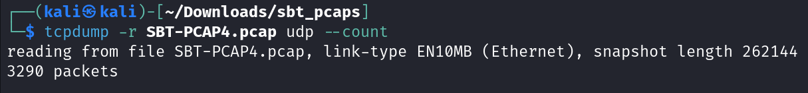
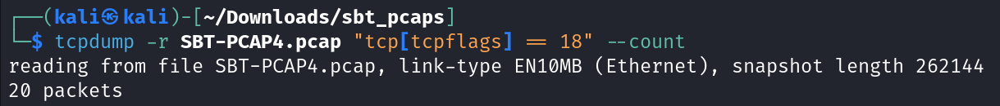
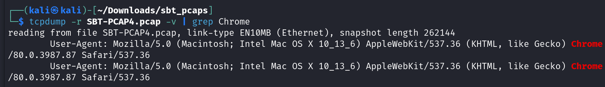
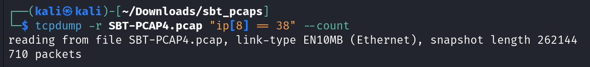
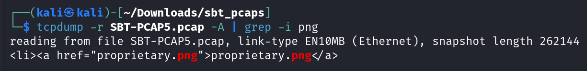
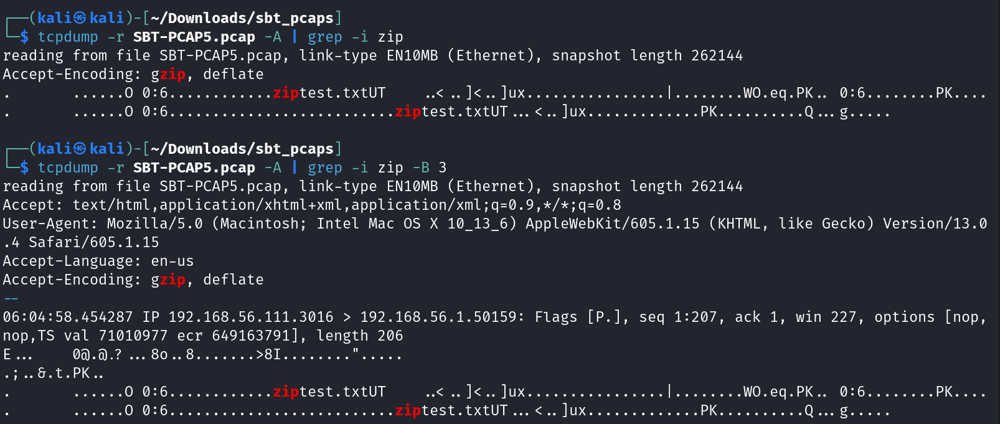
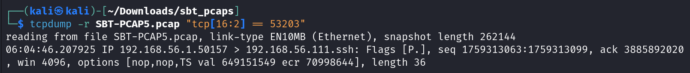

# Introduction to Network Analysis tcpdump Challenge

This write-up is about the tcpdump Challenge, which is part of Security Blue Team's Introduction to Network Analysis training course.

Link to the course: [Introduction to Network Analysis](https://www.securityblue.team/courses/introduction-to-network-analysis)

## Challenge

In this challenge, we are given two _.pcap_ files named _SBT-PCAP4.pcap_ and _SBT-PCAP5.pcap_. The following are the questions based on the given two pcap files:

```

PCAP 4

1. How many UDP packets have been captured?
2. How many TCP packets have both the SYN and ACK flags set?
3. Which version of Chrome was used to connect to securityblue.team?
4. How many packets have a TTL value of 38?

PCAP 5

1. What is the name of the PNG file on the webserver at 192.168.56.111?
2. Which version of OpenSSH is running on the server?
3. On which port is the .zip file being served?
4. When was a packet with a TCP checksum value of 53203 captured? (Format: xx:xx:xx.xxxxxx)

```

We will begin by analyzing PCAP 4 and then move on to PCAP 5.

## Tools Required

Since this is a tcpdump challenge, we will require tcpdump tool.

I used a Virtual Machine running Kali Linux as OS for this challenge, since tcpdump comes pre-installed with Kali Linux. However, you may download tcpdump for Windows by following instructions from [here](https://github.com/the-tcpdump-group/tcpdump/blob/master/doc/README.windows.md)

## Solution - PCAP 4

Let's start with analyzing PCAP 4. We will analyze the file as per the required information.

### UDP Packets

We need to find the number of UDP packets present in the pcap file. Hence, I wrote the following command:

```
tcpdump -r SBT-PCAP4.pcap udp --count
```

This command shows the total number of UDP packets present in the _SBT-PCAP4.pcap_ file as shown in the image below.



Hence, there are `3290` UDP packets present in the _SBT-PCAP4.pcap_ file.

### TCP Packets with SYN and ACK flags set

TCP header consists a total of 8 flags. Each flag can have a value of either 0 or 1, with 1 meaning the flag is set. Hence, all 8 flags combine form a 8 bit binary number.

From left-to-right, the SYN flag is at 7th position while ACK flag is at 4th position. Thus, our 8 bit binary number denoting both SYN and ACK flag set will be `00010010`. The decimal equivalent of this binary number will be `18`.

Hence, I wrote the following command to count the total number of packets that have both SYN and ACK flags set:

```
tcpdump -r SBT-PCAP4.pcap "tcp[tcpflags] == 18" --count
```

The following image shows the output of the command.



Hence, there are `20` packets with SYN and ACK flags set.

### Chrome Version

In order to find the Chrome version, we will require a more verbose output from tcpdump this time. There are no specific commands to filter by browser name in tcpdump, hence I used _`grep`_ utility of Linux, as shown in the following command:

```
tcpdump -r SBT-PCAP4.pcap -v | grep Chrome
```

The following image shows the output of the above command.



Hence, the Chrome version used is `80.0.3987.87`.

### TTL 38

Time-to-live (TTL) is a field in IPv4 header. This field is present at the `9th byte` of the IPv4 header. Hence, the index of the TTL field in the IPv4 header will be `8` (index counting starts at 0).

Therefore, I wrote the following command to count the total number of packets with TTL equal to 38:

```
tcpdump -r SBT-PCAP4.pcap "ip[8] == 38" --count
```

The following image shows the output of the above command.



Hence, there are `710` packets that have TTL value of 38.

### Answering the PCAP 4 Challenge

Now, we have all the required information to answer this challenge.

1. How many UDP packets have been captured? `3290`
2. How many TCP packets have both the SYN and ACK flags set? `20`
3. Which version of Chrome was used to connect to securityblue.team? `80.0.3987.87`
4. How many packets have a TTL value of 38? `710`

Now, let us move on to PCAP 5 Challenge solution.

## Solution - PCAP 5

Let's analyze the _SBT-PCAP5.pcap_ file based on the requested information.

### PNG File Name

Since we need to find the name of the PNG file, we will require to view the content of the packets as well. The `-A` tag in tcpdump helps us to view the contents of the packet as well. Hence, I wrote the following command to filter the packet containing _`png`_ string in its content:

```
tcpdump -r SBT-PCAP5.pcap -A | grep -i png
```

The following image shows the output of the above command.



There is only one line from the entire pcap file that contains a _.png_ file, hence this must be our required file. The name of the _.png_ file is `proprietary.png`.

### OpenSSH Version

We will require a more verbose output from tcpdump this time to also view the OpenSSH version. I wrote the following command to filter packets using OpenSSH:

```
tcpdump -r SBT-PCAP5.pcap -v | grep -i openssh
```

The following image shows the output of the above command.


There are 2 packets having OpenSSH string in them. We know that the web server is running at _`192.168.56.111`_. Hence, the OpenSSH server used by _`192.168.56.111`_ is `OpenSSH v7.9p1`. Hence, the required OpenSSH version is `7.9p1`.

### ZIP File

Since we need to filter packets with the presence of _.zip_ file, we need to also view the content of the packets. Hence, I wrote the following command to filter the packet dealing with _.zip_ file:

```
tcpdump -r SBT-PCAP5.pcap -A | grep -i zip
```

However, as shown in the image below, it did not show the port number, but did show _gzip_ as one of the accepted encoding which confirms that this packet is related to _.zip_ file.  Hence, we just need to display some more lines before this output to view the IP address and port number information. Hence, the following is the modified command:

```
tcpdump -r SBT-PCAP5.pcap -A | grep -i zip -B 3
```

This command displays 3 more lines before the normal output as shown in the image below.



The information shows source socket as _`192.168.56.111.3016`_ which is of the format _`IP.Port`_. Since _`192.168.56.111`_ is the IP address of the server, `3016` is the port on which the _.zip_ file is served.

### Timestamp

We need to find the timestamp when the packet with TCP Checksum value of 53203 was captured.

Checksum is a field in the TCP header. The checksum is `2 bytes long` and starts at the `17th byte` of the TCP header. Hence, the index of the checksum field in the TCP header will be `16` since we start counting at 0.

However, unlike _`ip[8]`_ which we used previously in PCAP 4 challenge, we cannot simply use _`tcp[16]`_ as by default it will only read `1 byte` at index 16. Since checksum is 2 bytes long, we need to clarify that we are reading 2 bytes at index 16, which can be done with the syntax _`tcp[16:2]`_. Hence, I wrote the following command to filter the packet with checksum value of 53203:

```
tcpdump -r SBT-PCAP5.pcap "tcp[16:2] == 53203"
```

The following image shows the output of the above command.



Hence, the timestamp at which this packet was captured is `06:04:46.207925`.

### Answering the PCAP 5 Challenge

Now, we have all the information to answer the challenge questions.

1. What is the name of the PNG file on the webserver at 192.168.56.111? `proprietary.png`
2. Which version of OpenSSH is running on the server? `7.9p1`
3. On which port is the .zip file being served? `3016`
4. When was a packet with a TCP checksum value of 53203 captured? (Format: xx:xx:xx.xxxxxx) `06:04:46.207925`