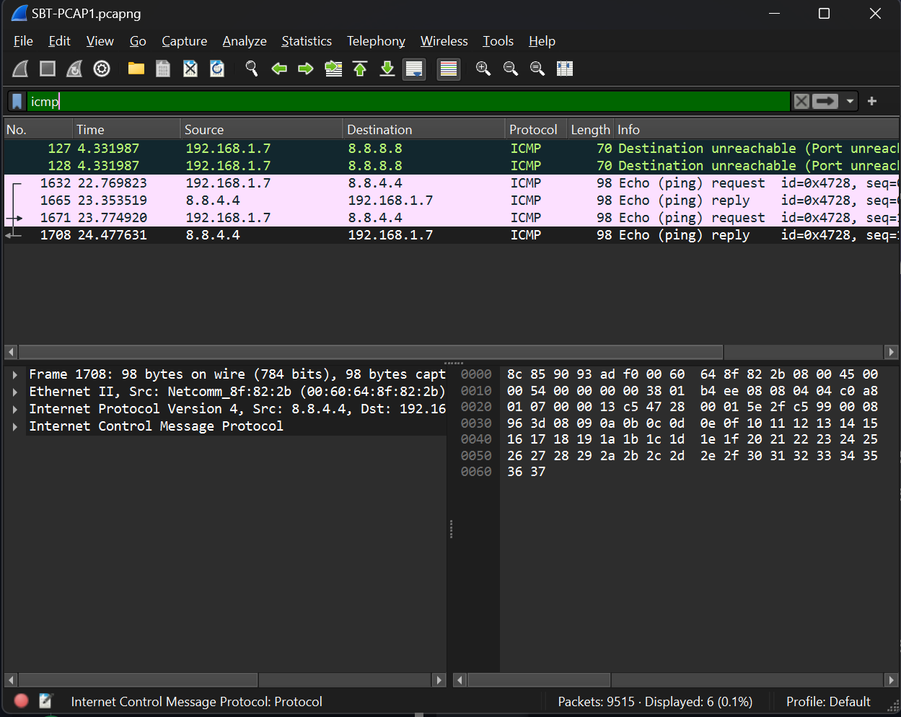
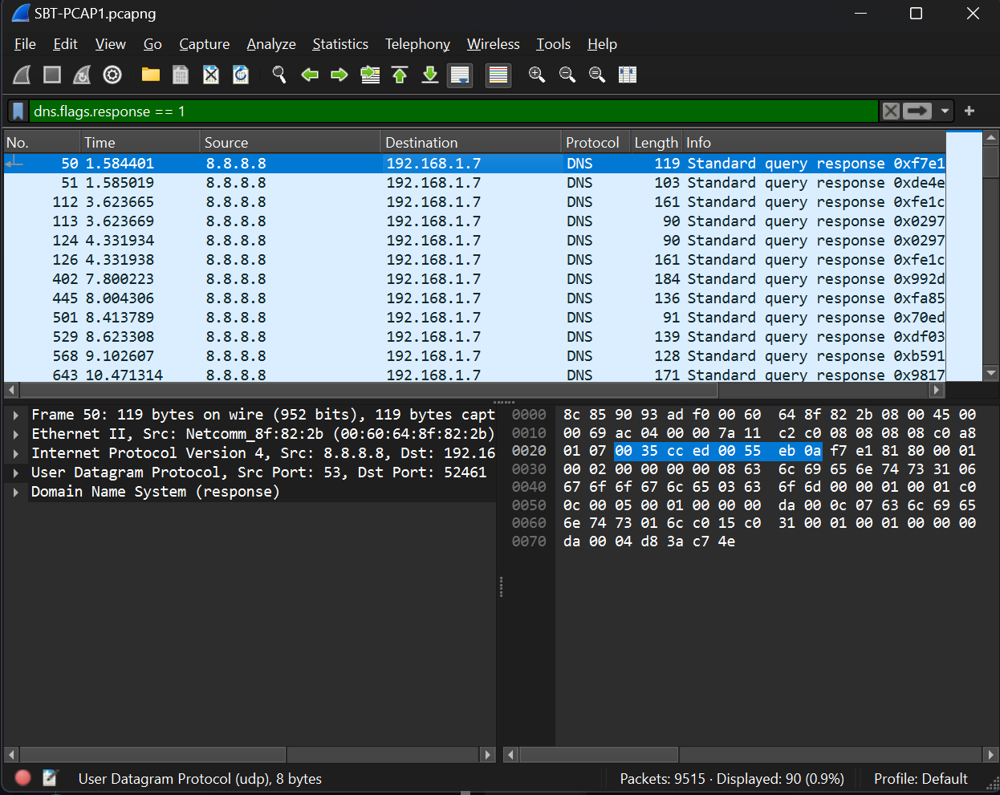
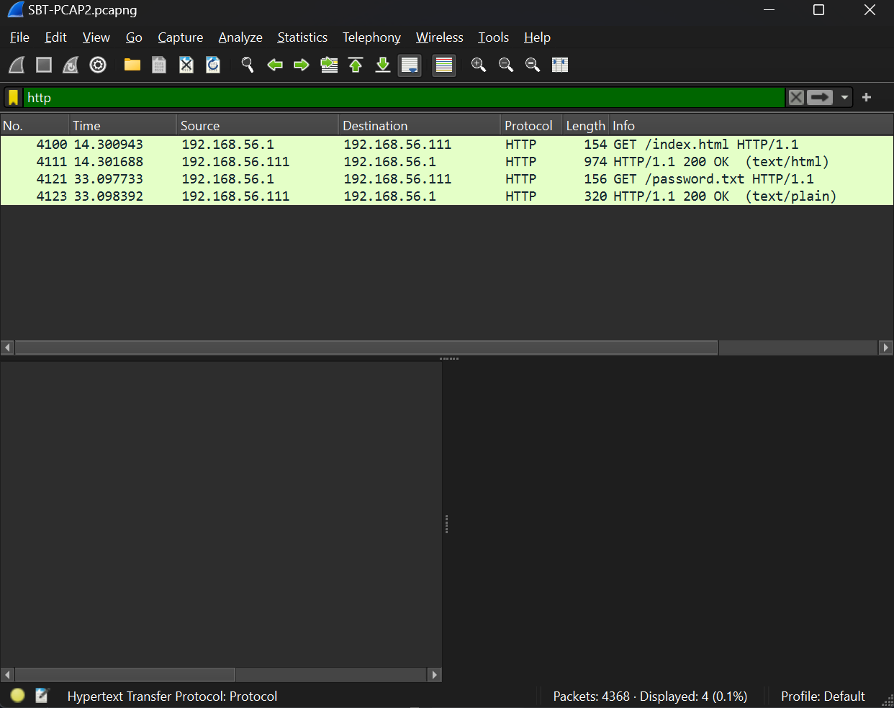
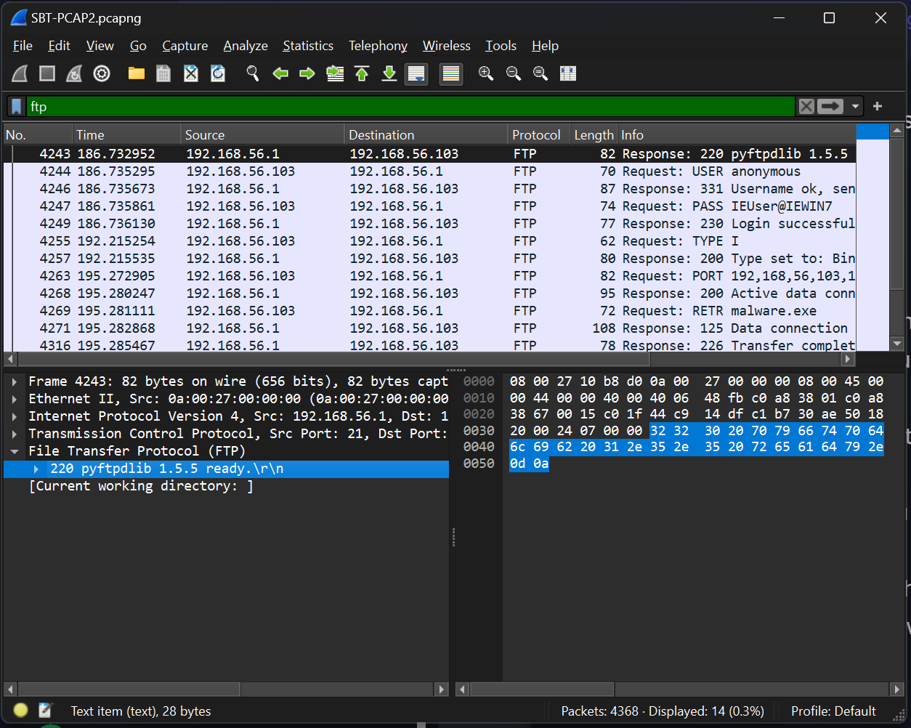
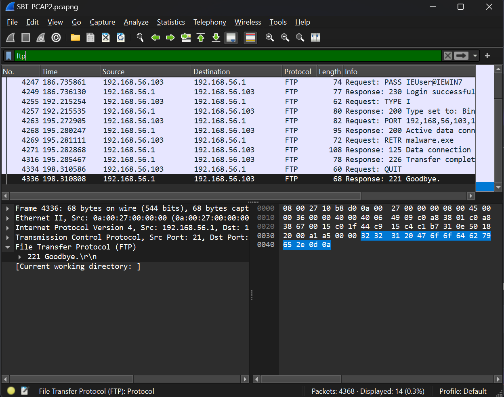
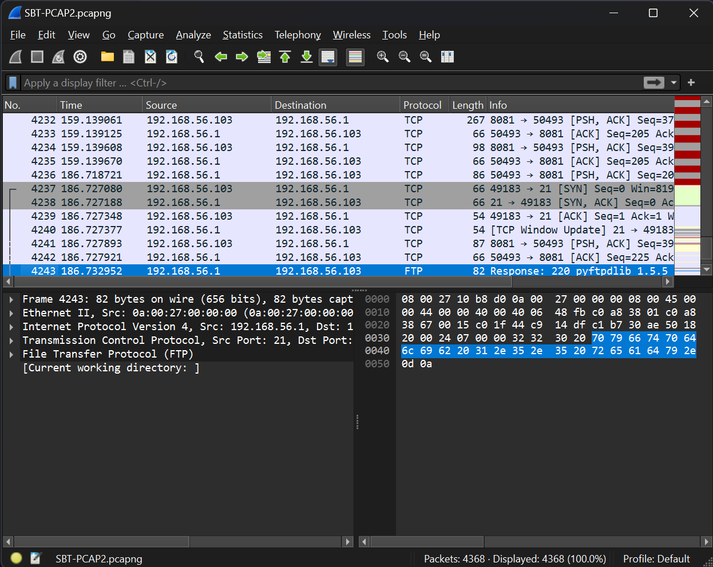
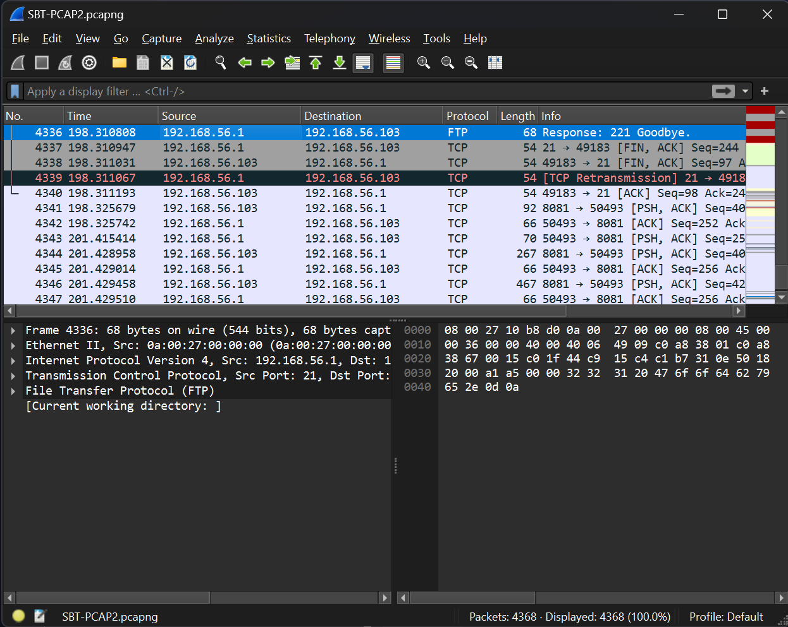
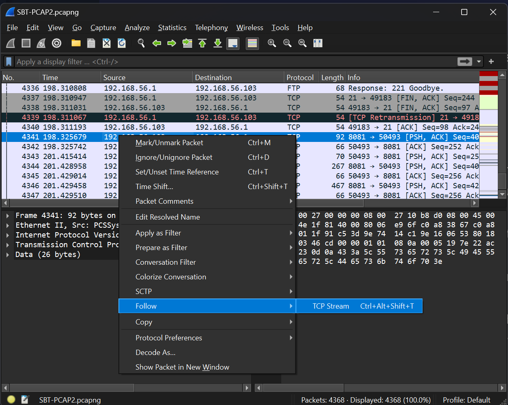
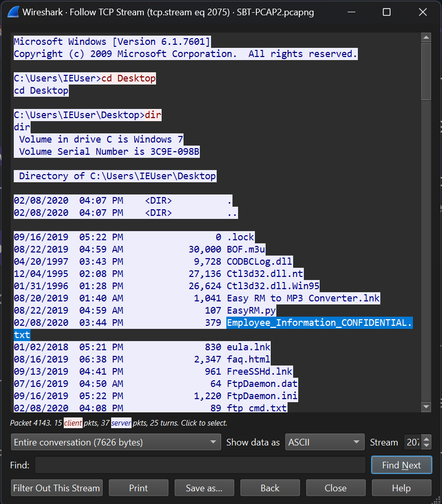
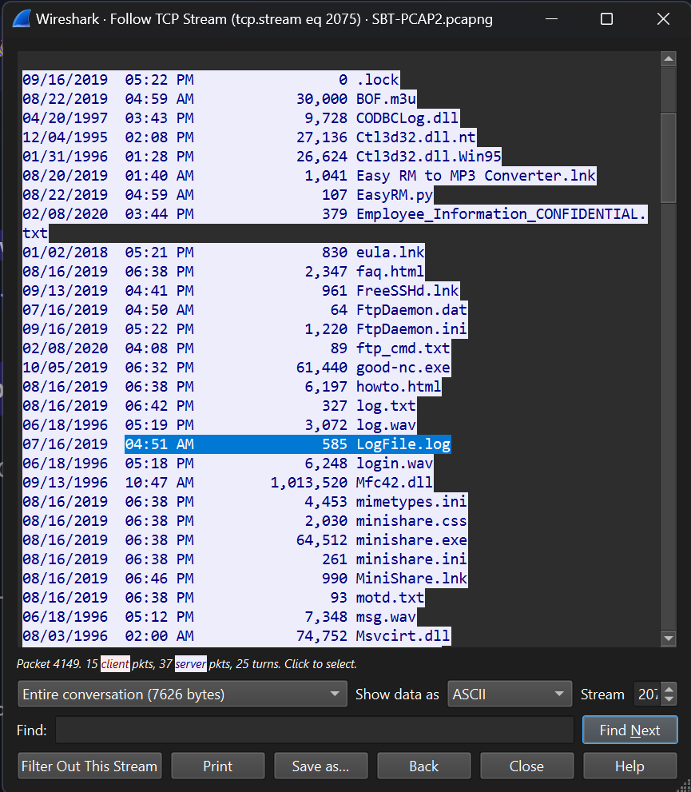

# Introduction to Network Analysis Wireshark Challenge Writeup

This writeup is for the Wireshark Challenge present in the Introduction to Network Analysis training course of Security Blue Team.

Link to the course: [Introduction to Network Analysis](https://www.securityblue.team/courses/introduction-to-network-analysis)

## Challenge

In this challenge, we are provided with two _.pcap_ files, which are the Wireshark capture files, for analysis. We need to find answers for the requested information.

The following is the requested information:

```

PCAP 1

1. Which protocol was used over port 3942?
2. What is the IP address of the host that was pinged twice?
3. How many DNS query response packets were captured?
4. What is the IP address of the host which sent the most number of bytes?

PCAP 2

1. What is the WebAdmin password?
2. What is the version number of the attacker's FTP server?
3. Which port was used to gain access to the victim Windows host?
4. What is the name of the confidential file on the Windows host?
5. What is the name of the log file that was created at 4:51 AM on Windows host?

```

We will begin by analyzing PCAP 1 and then move on to PCAP 2.

## Tools Required

Before we begin, we need to have the necessary tools in our arsenal. For this challenge, we only require one tool, which is Wireshark.

You may download Wireshark from [here](https://www.wireshark.org/download.html).

## Solution - PCAP 1

Let's open PCAP 1 file in Wireshark. The file is named as _SBT-PCAP1.pcap_.

### Protocol on Port 3942

I do not know whether the port 3942 is a TCP port or a UDP port. Hence, I wrote the following filter in Wireshark:

```
tcp.port == 3942 || udp.port == 3942
```

The following image shows the filtered packets.


Hence, the protocol active on port 3942 is `SSDP`, other wise known as `Simple Service Discovery Protocol`, and it is a `UDP port`.

### IP address of pinged host

We need to find the IP address of a host that was pinged twice. I know that pings use ICMP (Internet Control Message Protocol). Hence, I wrote the following filter Wireshark:

```
icmp
```

The following image shows the filtered packets.



We see two ICMP Requests here, and the destination IP address is `8.8.8.4.4`. Hence, the host that was pinged twice is `8.8.4.4`.

### Total DNS Query Response Packets

We need to find the total number of DNS Query Response packets present in the entire pcap file.

A DNS packet has various flags which are set to determine the type of DNS packet, like DNS Query, DNS Query Response, etc. A DNS Query Response packet has the _Response Flag_ set to _1_. Hence, I wrote the following Wireshark filter to filter out only DNS Query Response packets:

```
dns.flags.response == 1
```

The following image shows the filtered packets.



At the bottom of the window, we can see that the total number of packets displayed are 90. Hence, the total number of DNS Query Response packets in this pcap are `90`.

### IP Address of the host that sent most number of bytes

We need to find the IP address of the host that sent the most number of bytes. For this, we will leverage Wireshark's capture statistics.

Click on `Statistics > Endpoints` from the menu bar, since we need to view statistics of endpoints.

A new window will pop up displaying endpoint statistics. Since majority of the communication is through TCP, click on TCP tab. Now sort the list by _`Tx Bytes`_ in descending order as shown in the image below. _`Tx Bytes`_ refers to _transferred bytes_, in other words _the number of bytes sent from the endpoint_. The topmost endpoint after sorting the list will have the most number of bytes sent.


The IP address of the endpoint that sent the higest number of bytes is `115.178.9.18`.

### Answering the PCAP 1 Challenge

Now, we have found answers to the requested information.

1. Which protocol was used over port 3942? `SSDP`
2. What is the IP address of the host that was pinged twice? `8.8.4.4`
3. How many DNS query response packets were captured? `90`
4. What is the IP address of the host which sent the most number of bytes? `115.178.9.18`

Now, let us move on to solving PCAP 2 Challenge

## Solution - PCAP 2

Let's open PCAP 2 file in Wireshark. The file is named as _SBT-PCAP2.pcap_.

### Finding the WebAdmin Password

Since we need to find the WebAdmin password, I think we are looking at the HTTP traffic. There must be HTTP traffic where the password is exchanged. Since its HTTP, we can read the exchange as it is un-encrypted. Hence, I wrote the following Wireshark filter to filter out HTTP traffic:

```
http
```

The resulting filtered packets are shown in the image below.



We can see that in _`Packet #4121`_, the _password.txt_ file has been requested, and _`Packet #4123`_ has the response, which is the contents of _password.txt_ file. Let's right-click on _`Packet #4121`_, and click on _`Follow > HTTP Stream`_. A new window will popup as shown in the image below.


Just as I predicted, the WebAdmin password is transmitted in plaintext here, which is `sbt123`.

### FTP Version

Since we need to find the version number of FTP server, run by the attacker, let's filter the FTP packets with the following Wireshark filter:

```
ftp
```

The following image shows the filtered packets and the packet that holds FTP version.



It is clear from _`Packet #4243`_ that the FTP server used by the attacker is `pyftpdlib 1.5.5` with the version number being `1.5.5`.

Also, we can deduct that the IP address of the attacker is _`192.168.56.1`_, and since it is likely to communicate with the victim machine, the IP address of the victim machine is _`192.168.56.103`_.

### Finding the Port used for gaining access

Let's first observe the FTP traffic we saw just now as it holds some interesting information. The following image shows the FTP traffic.



The _`Packet #4336`_ is the last packet related to FTP traffic. However, if we observe the previous packets, we see that the victim machine with IP address _`192.168.56.103`_ is requesting _malware.exe_ file from the attacker's FTP server. Hence, we can conclude that the victim machine is already in control of the attacker.

Hence, the attacker is connected to the victim machine and also giving it instructions, maybe via commands. The FTP traffic that is generated, is due to attacker instructing the victim machine to get _malware.exe_ file from their server. The FTP exchange is taking place during the attack session.

The attacker must be connected to the victim machine via a port, which is running this session. We need to find this port.

Now, we know that the first packet of this FTP traffic is _`Packet #4243`_. Let's observe the traffic before this packet. The following image shows the traffic before _`Packet $4243`_.



We can see that there are bunch of exchanges between the victim machine (_`192.168.56.103`_) and the attacker machine (_`192.168.56.1`_). We can also see that the attacker machine is using _`Port 50493`_ and the victim machine is using _`Port 8081`_. Hence, we can say that `Port 8081` is the port on the victim machine that the attacker used to gain access to the victim machine.

To confirm this, let's see the traffic after the last packet of FTP (_`Packet #4336`_). The following image shows the packets after completion of FTP traffic.



We again see exchange between the victim machine using _`Port 8081`_ and the attacker machine using _`Port 50493`_.

Hence, the FTP session is a part of the overall attack session. The Wireshark traffic proves this as the FTP traffic is sandwiched between the actual attack session.

In conclusion, the target port is `Port 8081`.

### Finding the Confidential File

Since the traffic that is enclosing the FTP traffic is the traffic related to the attack session, we need to observe that. Now, it is difficult to observe through normal Wireshark window. Hence, we need to follow the TCP stream in order to get a clear picture.

Right-click on any packet before or after the FTP traffic. I selected the packet after FTP traffic as shown in the image below.



It will open a new window, as shown in the image below.



We can see the session the attacker is having with the victim machine. The part with blue font and background is by the victim machine, while the part with red font and background is by the attacker. Hence, we can see that the attacker is interacting with the command prompt of the victim machine.

The attacker has listed the files in present directory using the _dir_ command. I have highlighted the name of the confidential file, which is `Employee_Information_CONFIDENTIAL.txt`.

Do not close this window yet, as we will continue to next task on this window.

### Finding the Log File

As we scroll down the window, we will find the log file that was generated at 4:51 AM, as shown in the image below.



Hence, the name of the required log file is `LogFile.log`.

### The Attack

We have already gathered all the information asked in the challenge. However, I need to observe this TCP Stream further in order to see the complete attack, and verify the FTP conversation.

As we further scroll down the window, we see that the attacker is creating a text file containing script to execute FTP conversation, from connecting to attacker's FTP server to downloading _malware.exe_ file, as shown in the image below.


Clearly, the attacker saved the script in _1.txt_ file, and used it as script to connect to the attacker's FTP server. The file _malware.exe_ is downloaded from this process. The attacker then again lists the files present in the directory.

The following image shows the presence of _malware.exe_ file in the present directory, which was not present in the previous instance of directory listing.


The _malware.exe_ file was downloaded on _02/08/2020 4:14 PM_.

### Answering the Challenge

Now, we have found all the information to answer the challenge questions.

1. What is the WebAdmin password? `sbt123`
2. What is the version number of the attacker's FTP server? `1.5.5`
3. Which port was used to gain access to the victim Windows host? `8081`
4. What is the name of the confidential file on the Windows host? `Employee_Information_CONFIDENTIAL.txt`
5. What is the name of the log file that was created at 4:51 AM on Windows host? `LogFile.log`

This marks the end of both challenges.