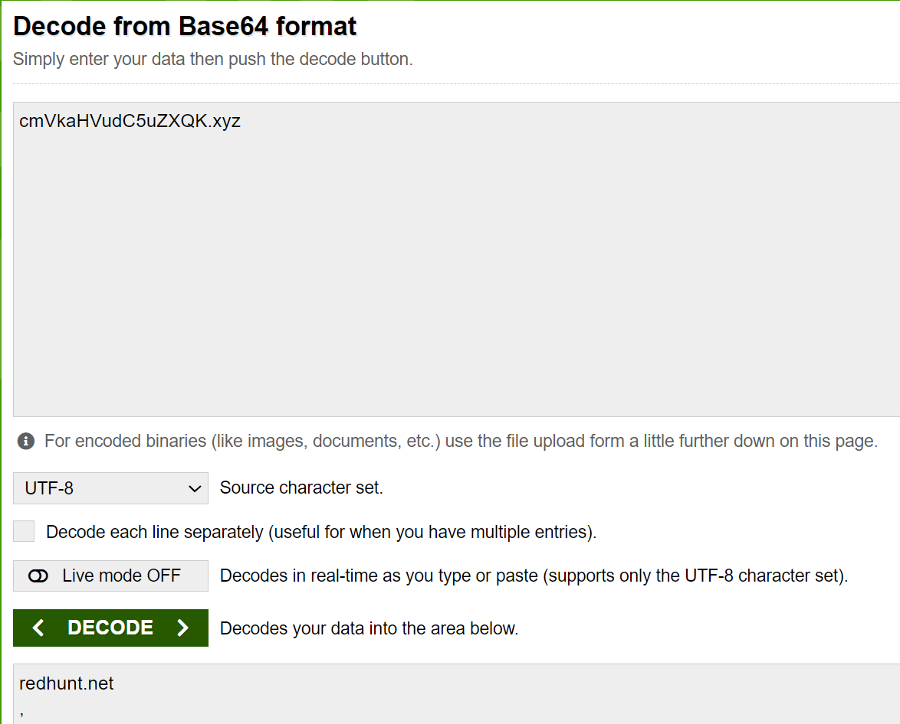
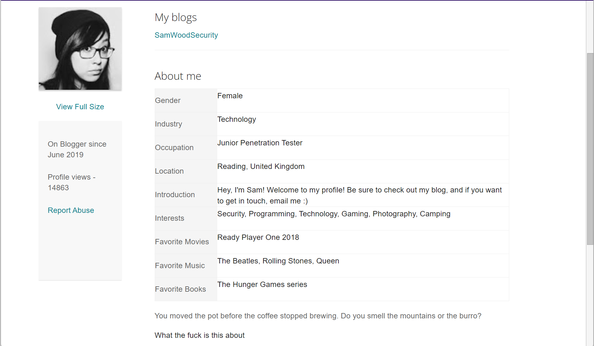
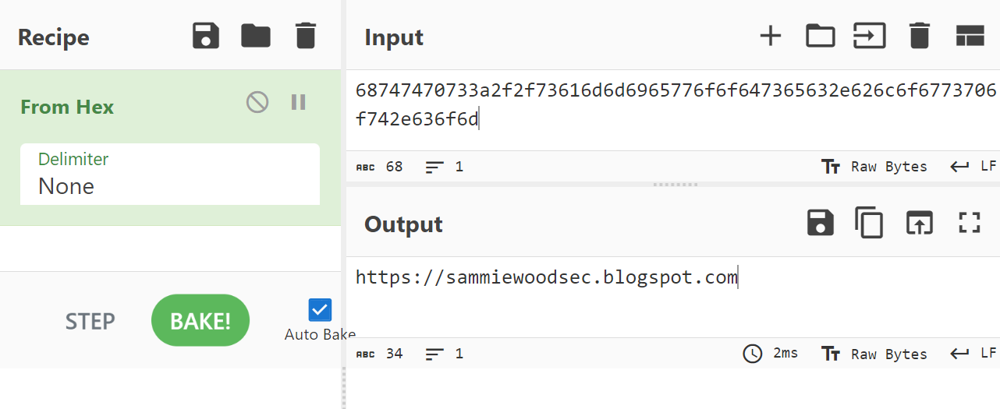
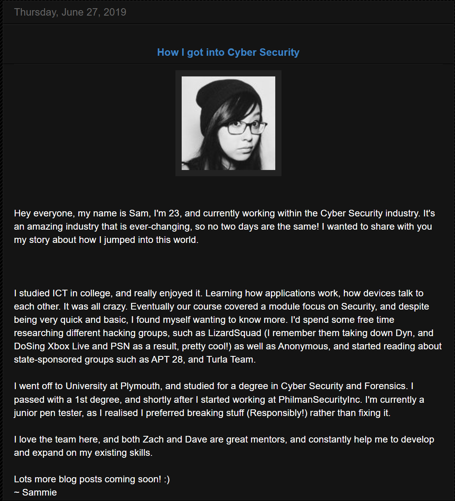

# Introduction to OSINT Capstone Writeup

This writeup is for Introduction to OSINT Capstone which is a part of Security Blue Team's Introduction to OSINT course.

Link to the course: [Introduction to OSINT](https://www.securityblue.team/courses/introduction-to-osint)

## Challenge

The following is the text from the document describing the challenge:

```
 ___________   _____ _   ____   _______ ___   _      _     
|  _  | ___ \ /  ___| | / /\ \ / /  ___/ _ \ | |    | |    
| | | | |_/ / \ `--.| |/ /  \ V /| |_ / /_\ \| |    | |    
| | | |  __/   `--. \    \   \ / |  _||  _  || |    | |    
\ \_/ / |     /\__/ / |\  \  | | | |  | | | || |____| |____
 \___/\_|     \____/\_| \_/  \_/ \_|  \_| |_/\_____/\_____/
                                                           
                                                           
Investigation into MSP data breach. Clear web investigation team.

===============================++===============================


Known Info:
=================
Twitter Handle: @sp1ritfyre

Required Info:
=================
[1] First Name:
[2] Last Name:
[3] Age:
[4] Country:
[5] Interests (5 minimum):
[6] Hacker's employer (company name):
[7] Hacker's position within company:

Online Presence:
=================================
[8] Self-Owned Website (Hacker owns the domain):
[9] Other Websites (Person does not own the domain, such as blogs):

Evidence Collection:
=================================
[10] Any URLs of webpages that directly tie individual to MSP breach:

Email Addresses Utilised:
=================================
[11] What email addresses have been used by the hacker? (2)

===============================++===============================

```

## Solution

The only known information regarding the suspect is their Twitter/X handle, which is `@sp1ritfyre`.

### Search the username

Since we only know the Twitter/X handle of of the suspect, we will start from there. So let's look up for this account. We can simply search this username on Google. I got some results out of which two caught my attention which are mentioned in the images below.


We found 2 profiles by the username `sp1ritfyre`: on Twitter/X and Blogger. We will start with the Twitter/X account.

### Twitter/X Account

Let's view the Twitter/X account of the target. The image below shows some information regarding the target.


There is a website link mentioned in the user info: `cmVkaHVudC5uZXQK.xyz`. This looks like a Base64 encoded string. Thus, I used an online tool to decode this string. The tool I used is at [https://www.base64decode.org/](https://www.base64decode.org/). The following image shows that it is indeed a Base64 encoded string.



Hence, we got one of the requested info: A website owned by the target which is `redhunt.net`. So, I visited the website and it had the same red bulb image as the Twitter/X post. I do not know what the red bulb image indicates, but it may indicate that the Twitter/X account and this website are handled by the same user. The image of the website home page is as shown below.


I did not find much from the website. Hence, I moved on to our second lead: the Blogger page.

### Blogger Account

I visited _Sp1ritFyre's_ Blogger account page and we get some more information about _Sp1ritFyre_ as shown in the image below.



The first thing I observed is the same red bulb image. This image feels like a trademark that shows that this content or website is handled by _Sp1ritFyre_.

I see that there is a hyperlink at `Hacker Stories`. Once I clicked on the link, I got redirected to `https://sp1ritfyrehackerstories.blogspot.com/` as shown in the image below.


However, there is not any new information here, but this is a blog website handled by _Sp1ritFyre_ which is part of a requested info.

Next, we get to learn that _Sp1ritFyre_ is a female. She joined Blogger in March 2020. We also get a "Location" that looks like a Hex string: `68747470733a2f2f73616d6d6965776f6f647365632e626c6f6773706f742e636f6d`. I used [CyberChef](https://cyberchef.org/) to decode this string, as it automatically detects the type of encoding and gives the decoded string, as shown in the image below.



Hence, we have now received another blog website: `https://sammiewoodsec.blogspot.com`.

### Blogspot Thread

I visited `https://sammiewoodsec.blogspot.com` and the image below shows the landing page.


We get a bunch of information from this website. From the little section on the right, we can see that the user's first name is `Sam` and the last name is `Woods`. Hence, our target's name is `Sam Woods` who also goes by the username `sp1ritfyre` on Twitter/X.

Also, from the text that I have highlighted, we get the personal email address of Sam, which is `d1ved33p@gmail.com`.

As I scrolled down, I found a blog where Sam discusses how she got into Cybersecurity which also provides additional information, as shown in the image below.



We find out that Sam's age is `23`. She went to `University of Plymouth`, and started working at `PhilmanSecurityInc.` as `Junior Pen Tester` shortly after she graduated.

Now, as we saw before, this website has an _About Me_ section. We will move on to Sam's About Me section now to see if we can find any new information.

### Sam Wood's Blogger Account

When clicked on visiting Sam's full profile, we get redericted to Sam's Blogger profile as shown in the image below.


We find some new additional information from this page. Sam is located in `Reading, United Kingdom`. She is interested in `Security, Programming, Technology, Gaming, Photography, and Camping`. Her favorite movie is `Ready Player One` which came out in 2018. Her favorite music bands are `The Beatles, Rolling Stones, and Queen`. Lastly, her favorite books are `The Hunger Games` series.

Now, we have enough information on our target _sp1ritfyre_ or _Sam Woods_ to filter out all the requested information and answer the questions.

### Answering the Challenge

Based on the collected information, we can now answer all the challenge questions.

1. What is the hacker's first name? `Sam`
2. What is the hacker's last name? `Woods`
3. What is the hacker's age? `23`
4. What country does the hacker live in? `United Kingdom`
5. What are some of the hacker's interests? `Security, Programming, Technology, Gaming, Photography, and Camping`
6. What company does the hacker work for? `PhilmanSecurityInc.`
7. What is the hacker's position within the company? `Junior Pen Tester`
8. What is the full URL of the website owned by the hacker? `https://redhunt.net`
9. List any full URLs of the websites not owned, but used by the hacker (Blogs only). `https://sammiewoodsec.blogspot.com/, https://sp1ritfyrehackerstories.blogspot.com/`
10. What email address has been used by the hacker? `d1ved33p@gmail.com`

This marks the end of the challenge.